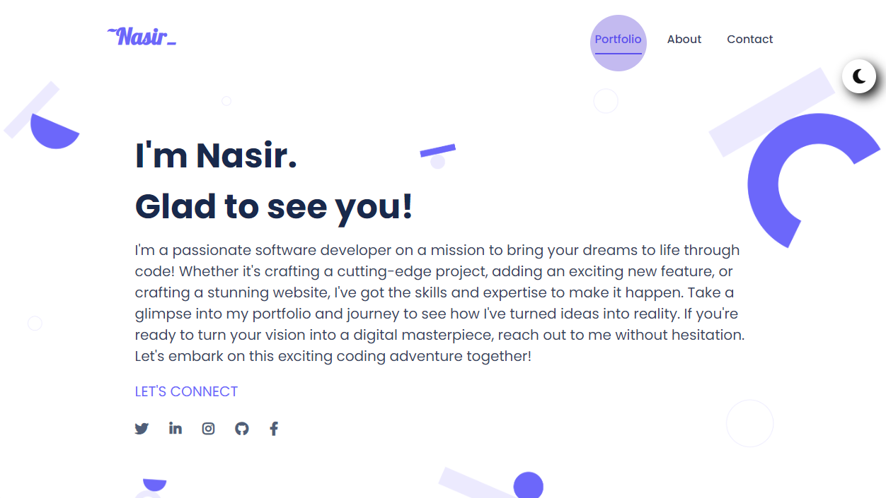

<a name="readme-top"></a>

<div align="center">
  <h1><b>Personal Portfolio</b></h1>

</div>

<!-- TABLE OF CONTENTS -->

# 📗 Table of Contents

- [📖 About the Project](#about-project)
  - [🛠 Built With](#built-with)
  - [🚀 Live Demo](#live-demo)
- [💻 Getting Started](#getting-started)
  - [Setup](#setup)
  - [Prerequisites](#prerequisites)
  - [Deployment](#triangular_flag_on_post-deployment)
- [👥 Authors](#authors)
- [🤝 Contributing](#contributing)
- [⭐️ Show your support](#support)
- [🙏 Acknowledgements](#acknowledgements)
- [📝 License](#license)

<!-- PROJECT DESCRIPTION -->

# 📖 Personal Portfolio <a name="about-project"></a>



**Personal Portfolio:** The Personal Portfolio project served as a platform for me to demonstrate my technical proficiency and present my projects in a compelling manner to potential employers.

## 🛠 Built With <a name="built-with"></a>

  <ul>
    <li>HTML</li>
    <li>CSS</li>
    <li>JavaScript</li>
  </ul>


<p align="right">(<a href="#readme-top">back to top</a>)</p>

<!-- LIVE DEMO -->

## 🚀 Live Demo <a name="live-demo"></a>

- [Live Project Demo](https://nasirkhan294.github.io/personal-portfolio/)

<p align="right">(<a href="#readme-top">back to top</a>)</p>

<!-- GETTING STARTED -->

## 💻 Getting Started <a name="getting-started"></a>

To get a local copy up and running, follow these steps.

### Prerequisites

In order to run this project you need:

```
   ssh code:
   git@github.com:Nasirkhan294/my-personal-portfolio.git
```

### Setup

Clone this repository to your desired folder:

```
  cd desired-folder
  git clone git@github.com:Nasirkhan294/my-personal-portfolio.git
```

### Deployment

You can deploy this project using **Github-Pages**. In order to make your project live on Github, you'll want to push your updated repo by using these commands:

```
git add --all or git add .

```

```
git commit -m "your commit message"

```

```
git push origin {i.e, your repo name}

```

<p align="right">(<a href="#readme-top">back to top</a>)</p>

<!-- AUTHORS -->

## 👥 Authors <a name="authors"></a>

👤 **Nasir Mahmood**

- GitHub: [Nasirkhan294](https://github.com/Nasirkhan294)
- LinkedIn: [nasirmahd](https://www.linkedin.com/in/nasirmahdkhan/)

<p align="right">(<a href="#readme-top">back to top</a>)</p>

<!-- FUTURE FEATURES -->

## 🔭 Future Features <a name="future-features"></a>

- [ ] **Portfolio Card Slider**

<p align="right">(<a href="#readme-top">back to top</a>)</p>

<!-- CONTRIBUTING -->

## 🤝 Contributing <a name="contributing"></a>

Contributions, issues, and feature requests are welcome!

Feel free to check the [issues page](../../issues/).

<p align="right">(<a href="#readme-top">back to top</a>)</p>

<!-- SUPPORT -->

## ⭐️ Show your support <a name="support"></a>

Please support this project and be a part of something meaningful and impactful. Your contribution can make a significant difference and help us achieve our goals faster.

<p align="right">(<a href="#readme-top">back to top</a>)</p>

<!-- ACKNOWLEDGEMENTS -->

## 🙏 Acknowledgments <a name="acknowledgements"></a>

To all the individuals whose creativity and dedication inspired the codebase, I want to express my heartfelt gratitude. Your tireless efforts have left an indelible mark on this project and your contributions will be remembered for years to come. Thank you for being an integral part of our success.

<p align="right">(<a href="#readme-top">back to top</a>)</p>

<!-- LICENSE -->

## 📝 License <a name="license"></a>

This project is [MIT](./LICENSE) licensed.

<p align="right">(<a href="#readme-top">back to top</a>)</p>
