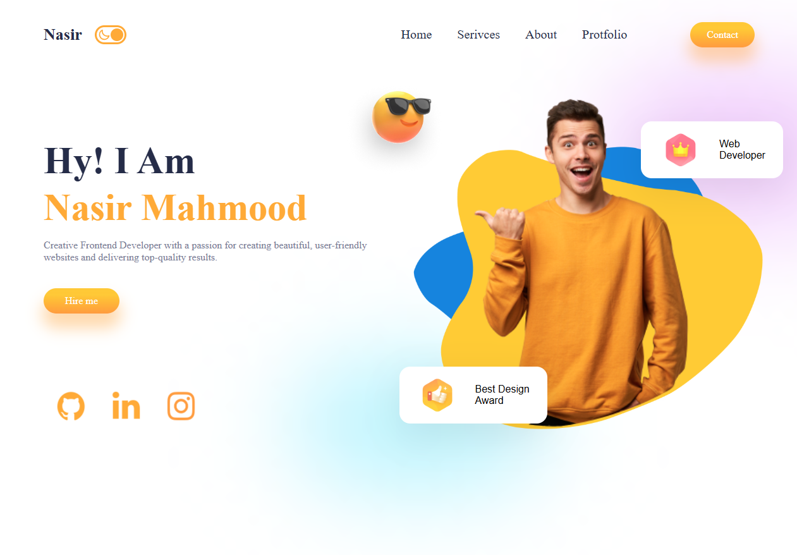

<a name="readme-top"></a>

<div align="center">
  <h1><b>Personal Portfolio</b></h1>

</div>

<!-- TABLE OF CONTENTS -->

# 📗 Table of Contents

- [📖 About the Project](#about-project)
  - [🛠 Built With](#built-with)
  - [🚀 Live Demo](#live-demo)
- [💻 Getting Started](#getting-started)
  - [Setup](#setup)
  - [Prerequisites](#prerequisites)
  - [Deployment](#triangular_flag_on_post-deployment)
- [👥 Authors](#authors)
- [🤝 Contributing](#contributing)
- [⭐️ Show your support](#support)
- [🙏 Acknowledgements](#acknowledgements)
- [📝 License](#license)

<!-- PROJECT DESCRIPTION -->

# 📖 Personal Portfolio <a name="about-project"></a>



The **Personal Portfolio** project is a platform that highlights my technical skills, projects, and achievements. It serves as a professional portfolio to showcase my work to potential employers and collaborators.

## 🛠 Built With <a name="built-with"></a>

  <ul>
    <li>HTML</li>
    <li>CSS</li>
    <li>JavaScript</li>
  </ul>


<p align="right">(<a href="#readme-top">back to top</a>)</p>

<!-- LIVE DEMO -->

## 🚀 Live Demo <a name="live-demo"></a>

- [Live Project Demo](https://nasir-personal-portfolio.netlify.app/)

<p align="right">(<a href="#readme-top">back to top</a>)</p>

<!-- GETTING STARTED -->

## 💻 Getting Started <a name="getting-started"></a>

To get a local copy up and running, follow these steps.

### Prerequisites

In order to run this project you need Git installed:

```
    git --version

```

### Setup

Clone this repository to your desired folder:

```
  cd desired-folder
  git clone git@github.com:Nasirkhan294/my-personal-portfolio.git
```

### Deployment

You can deploy this project using Netlify or GitHub Pages.

For GitHub Pages, push your repo with:

```
git add .

```

```
git commit -m "your commit message"

```

```
git push origin {i.e, your repo name}

```

For Netlify, drag and drop your project folder into [Netlify Deploy](https://app.netlify.com/)
.

<p align="right">(<a href="#readme-top">back to top</a>)</p>

<!-- AUTHORS -->

## 👥 Authors <a name="authors"></a>

👤 **Nasir Mahmood**

- GitHub: [Nasirkhan294](https://github.com/Nasirkhan294)
- LinkedIn: [nasirmahd](https://www.linkedin.com/in/nasirmahdkhan/)

<p align="right">(<a href="#readme-top">back to top</a>)</p>

<!-- FUTURE FEATURES -->

## 🔭 Future Features <a name="future-features"></a>

- [ ] **Portfolio Card Auto Slider**

<p align="right">(<a href="#readme-top">back to top</a>)</p>

<!-- CONTRIBUTING -->

## 🤝 Contributing <a name="contributing"></a>

Contributions, issues, and feature requests are welcome!

Feel free to check the [issues page](../../issues/).

<p align="right">(<a href="#readme-top">back to top</a>)</p>

<!-- SUPPORT -->

## ⭐️ Show your support <a name="support"></a>

If you like this project, please ⭐️ the repository and share it with others.

<p align="right">(<a href="#readme-top">back to top</a>)</p>

<!-- ACKNOWLEDGEMENTS -->

## 🙏 Acknowledgments <a name="acknowledgements"></a>

I would like to thank all the developers and designers whose work inspired me to create this portfolio. Special thanks to the open-source community for continuous learning resources.

<p align="right">(<a href="#readme-top">back to top</a>)</p>

<!-- LICENSE -->

## 📝 License <a name="license"></a>

This project is [MIT](./LICENSE) licensed.

<p align="right">(<a href="#readme-top">back to top</a>)</p>
